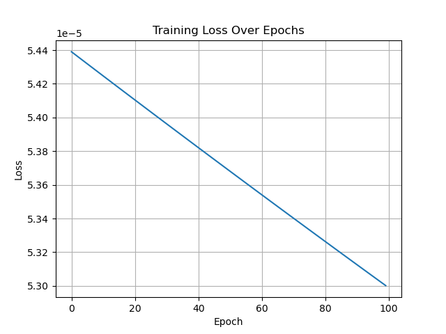

# 🧠 Neural Network From Scratch in NumPy

This project implements a fully-functional neural network from scratch using only **NumPy**—no external ML frameworks like TensorFlow or PyTorch.

It classifies **handwritten digit images** (0–9) and was trained on a custom dataset. The network uses a two-layer architecture with:
- Hidden Layer: 64 neurons (Sigmoid activation)
- Output Layer: 10 neurons (Softmax activation)

---

## 📌 Features

- 🧮 Custom-built forward and backward propagation
- 🧠 Manual implementation of softmax and cross-entropy loss
- 🧾 One-hot encoding of labels
- 🏋️ Gradient descent training loop
- 💾 Model persistence using `.npy` files which were obtained from training the model.
- 🧪 Interactive prediction with new digit images
- 📊 Live training loss visualization with Matplotlib

---

## 🧪 Example: Prediction Flow

1. You provide an image of a handwritten digit.
2. The model resizes it to 28x28, flattens it, and processes it.
3. It returns:
   - A probability distribution over digits 0–9
   - The predicted digit label

---
Path:
digi_9.png
 probab: [[1.24925632e-05 3.26402248e-06 9.46459732e-06 6.88287061e-05
  5.66156002e-09 1.63590010e-04 7.76711142e-06 3.50609788e-06
  2.20486190e-06 9.99728876e-01]]
label: 9

---

## 📊 Training Loss Over Epochs

Below is the graph of the **cross-entropy loss** over 100 epochs of training. This shows the model is effectively learning:

---

## 🧰 Tech Stack

- Python 3.x
- NumPy
- PIL (Python Imaging Library)
- Matplotlib
- NatSort (for sorted image loading)

---

## 🧠 Why Build from Scratch?

Most modern AI is built using massive libraries. But building a neural network manually shows:
- Mastery of linear algebra + gradient descent
- Deep understanding of model mechanics
- Ability to troubleshoot, optimize, and customize at the lowest level

This is ideal for roles or projects that require custom AI logic, educational tools, embedded ML, or low-dependency environments.

---

## 🗂 File Structure

├── main.py # Full training + prediction code
├── W1.npy, W2.npy # Saved weights
├── b1.npy, b2.npy # Saved biases
├── training_loss.png # Saved loss graph
├── test_images/ # Folder to store test digit images
└── README.md # You're here!
